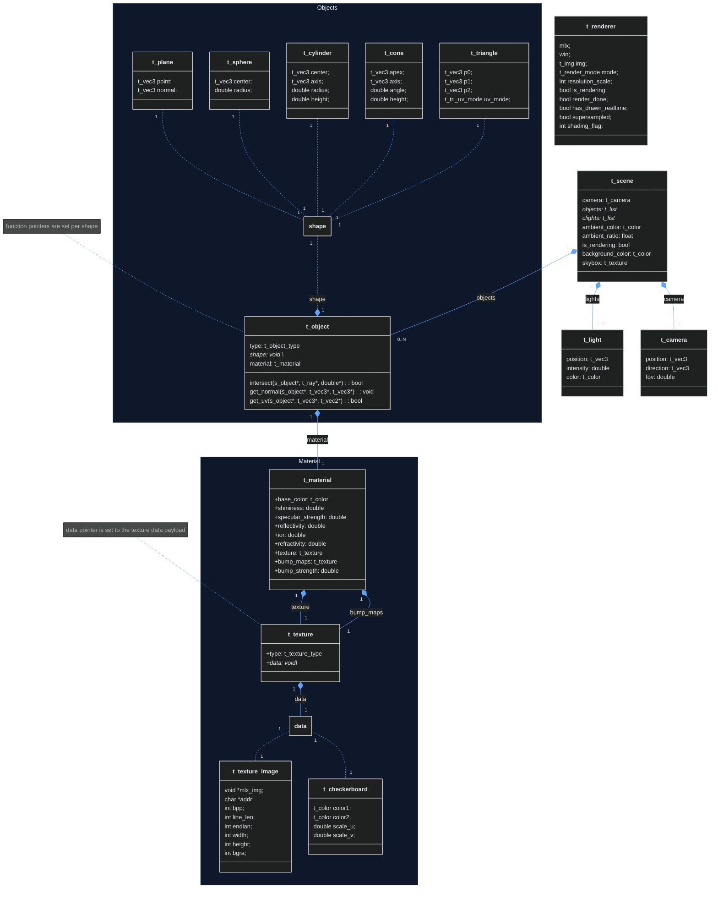

## Scene Data Structure Diagram

---

### Some explanations

The ***t_scene*** struct stores informations about the scene the program should render. It contains :
- a ***t_camera*** : the point, direction and angle from which the ray should be shot
- a list of ***t_lights***
- a list of ***t_objects***
- some infos about ambiant light
- some infos about the background of the scene : a solid color or a sky texture

The ***t_object*** struct stores information about an object in the scene. It uses a (*sort of*) polymorphic design, which allows it to describe any type of object. It contains : 
- a type : spheres, planes, cylinders, cones or triangles
- a *`void *shape`* pointer to a struct containing informations on the shape of the object it describes (***t_sphere***, ***t_plane***, ***t_cylinder***, ***t_cone*** or ***t_triangle***)
- three pointers to three functions :
  - a function pointer *`intersect()`*, initialized to *`intersect_sphere()`*, *`intersect_plane`*, etc.
  - a function pointer *`get_normal()`*, initialized to *`get_normal_cone()`*, *`get_normal_cylinder`*, etc.
  - a function pointer `get_uv()`, initialized to *`get_uv_sphere()`*, *`get_uv_triangle`*, etc.
- a ***t_material*** : informations on how to shade the object.

The ***t_material*** contains information on how to  shade a pixel resulting from the interesection of a ray and an object. It contains :
- a ***t_color*** base_color, the color of the surface of the object before texturing.
- a shininess and specular_strength, these number are used to compute the Blinn-Phong equation for specular highlight.
- an ior, (indice of refraction), determines how much the rays are bent when entering a medieum (the object), used to compute the fresnel equation and refractive materials.
- a reflectivity ratio, determines if and how much a surface reflects rays.
- a refractive ratio, determines if and how much a surface is translucide.
- a ***t_texture*** that defines the texture of the surface.
- a ***t_texture*** that defines a bump map.

Finally, the ***t_texture*** contains informations on textures. The *`void *data`* points to either a ***t_checkboard*** or a ***t_texture_image*** allocated in heap. 

***t_checkboard*** describes the characteristics of a checkboard texture : the color of each tile and their scale on each axis.

***t_texture_image*** stores a pointer to the texture data in heap, and infos used to parse the right bytes during the uv-wrapping process (may add some more details here).

For infos on the data primitives (t_color, t_vec3, etc), see the section 2) of this document : [*`.rt`* Scene Format](../docs/sceneinit_guide.md).

---