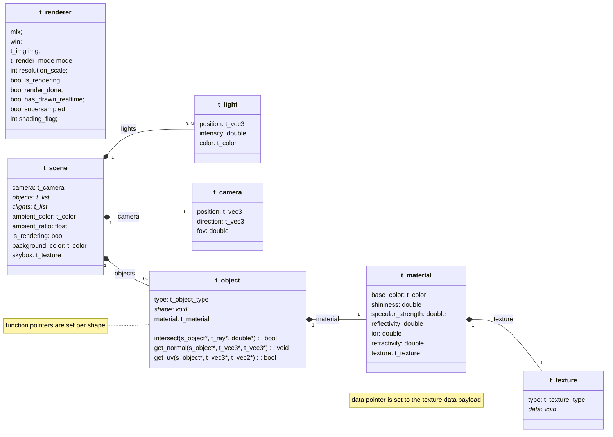

## Scene Data Structure Diagram

(Missing the shape structs and the texture payloads, because it looked bad and i have no idea how to format this mermaid mess).

---

### Some explanations

The ***t_scene*** struct stores informations about the scene the program should render. It contains :
- a camera : the point, direction and angle from which the ray should be shot
- a list of ***t_lights***
- a list of ***t_objects***
- some infos about ambiant light
- some infos about the background of the scene : a solid color or a sky texture

The ***t_object*** struct stores information about an object in the scene. It uses a (*sort of*) polymorphic design, which allows it to describe any type of object. It contains : 
- a type : spheres, planes, cylinders, cones or triangles
- a pointer to a struct containing informations on the shape of the object it describes (***t_sphere***, ***t_plane***, ***t_cylinder***, ***t_cone*** or ***t_triangle***)
- three pointers to three functions :
  - a function pointer *intersect()*, initialized to *intersect_sphere()*, *intersect_plane*, etc.
  - a function pointer *get_normal()*, initialized to *get_normal_cone()*, *get_normal_cylinder*, etc.
  - a function pointer *get_uv()*, initialized to *get_uv_sphere()*, *get_uv_triangle*, etc.
- a ***t_material*** : informations on how to shade the object.

Finally, the ***t_material*** contains information on how to  shade a pixel resulting from the interesection of a ray and an object. It contains :
- a ***t_color*** base_color, the color of the surface of the object.
- a shininess and specular_strength, these number are used to compute the Blinn-Phong equation for specular highlight.
- an ior, (indice of refraction), determines how much the rays are bent when entering a medieum (the object), used to compute the fresnel equation and refractive materials.
- a reflectivity ratio, determines if and how much a surface reflects rays.
- a refractive ratio, determines if and how much a surface is translucide.

The ***t_texture*** contains informations on textures, whether they are images or procedural checkerboards

See the render-loop control flow graph : [render-loop diagram](../docs/renderloop_ctrlflow.md).

---