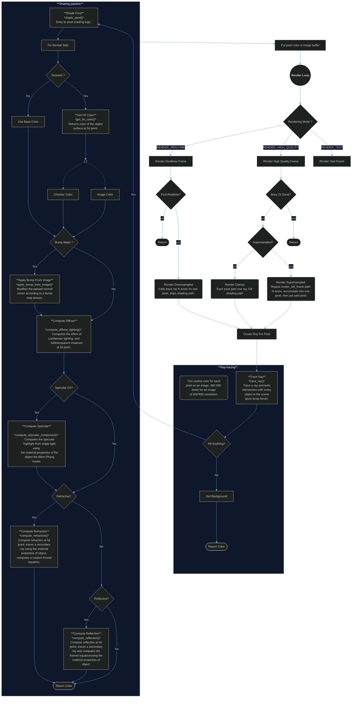

## Top-Level Render Loop Control Flow Diagram

Following the logic of the *render_loop* function and subsequent function calls and branches (not perfectly accurate).

First, we set up the ray-tracing conditions based on rendering modes. If the mode is RENDERING_REALTIME, a frame will be drawn without any shading whatsoever, and in a low resolution format. If the mode is RENDERING_HQ, a real shaded image will be rendered. If supersampled is activated, for one pixel, multiple rays will be shot and blended in (supersampling anti-aliasing, see SSAA on wikipedia).

Then, for each pixel, we trace a ray, and if the ray intersects an object, we follow the shading pipeline. Each operation in the shading pipeline starting with *compute_comp* return a componment that is either added or blended into the color of the pixel, using the material properties of the surface of the object the ray has hit.

See the data structure diagram : [data-struct diagram](../docs/data_struct.md).

---

---